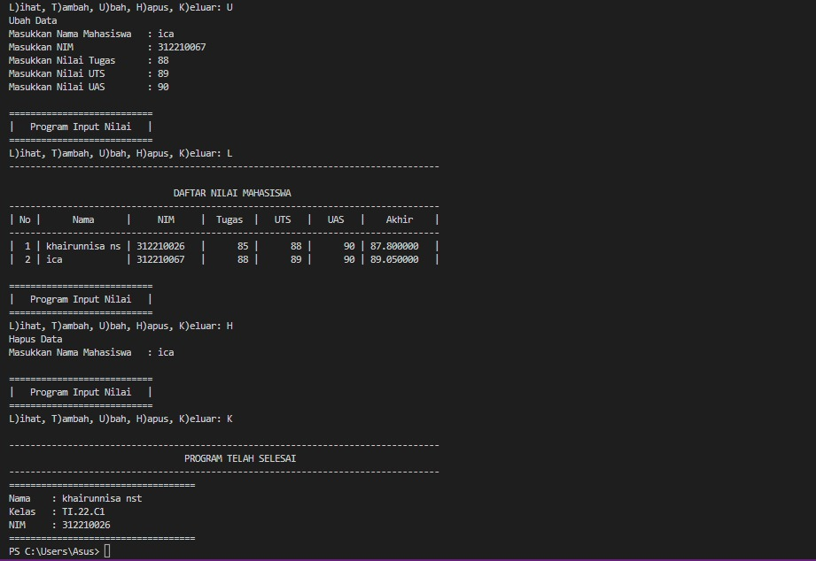

#praktikum7
```
Nama   : KHAIRUNNISA NASUTION
Nim    : 312210026
Matkul : BAHASA PEMROGRAMAN
```

# LATIHAN1
## Mengubah kode dibawah ini menjadi fungsi menggunakan lambda

## sebelumnya
```
import math

def a(x):
return x**2

def b(x, y):
return math.sqrt(x**2 + y**2)

def c(*args):
return sum(args)/len(args)

def d(s):
return "".join(set(s))
```
## sesudah diubah
## Code Source
```
import math
def a(x):
  return x**2
a = lambda x : x**2
print(a(2))
def b(x, y):
  return math.sqrt(x*2 + y*2)
b = lambda x, y : x * 2 + y * 2
print(b(2, 2))
def c(*args):
  return sum(args)/len(args)
c = lambda *args : sum(args)/len(args)
print(c(1,2,3,4,5))
def d(s):
  return "".join(set(s))
d = lambda s: "".join(set(s))
print(d("ica"))
```

## Output


# TUGAS PRAKTIKUM
## MEMBUAT PROGRAM MENGINPUT NILAI MAHASISWA MENGGUNAKAN FUNGSI

## Code Source
```
x = mahasiswa = {}

def tambah():
    print("Tambah Data")
    nama = input("Masukkan Nama Mahasiswa   : ")
    nim = input("Masukkan NIM              : ")
    tugas = int(input("Masukkan Nilai Tugas      : "))
    uts = int(input("Masukkan Nilai UTS        : "))
    uas = int(input("Masukkan Nilai UAS        : "))
    akhir = tugas * 30/100 + uts * 35/100 + uas * 35/100
    mahasiswa[nama] = nim , tugas, uts , uas , akhir
def tampilkan():
    if mahasiswa.items():
        print("---------------------------------------------------------------------------------")
        print("\n                               DAFTAR NILAI MAHASISWA                    ")
        print("---------------------------------------------------------------------------------")
        print("| No |      Nama      |     NIM     |  Tugas  |   UTS   |   UAS   |    Akhir    |")
        print("---------------------------------------------------------------------------------")
        i = 0
        for b in mahasiswa.items():
             i += 1
             print("| {no:2d} | {0:14s} | {1:11s} | {2:7d} | {3:7d} | {4:7d} | {5:7f}   |"
                . format ( b [ 0 ][: 14 ], b [ 1 ][ 0 ], b [ 1 ][ 1 ], b [ 1 ][ 2 ], b [ 1 ][ 3 ], b [ 1 ][ 4 ] , no = i ))
        print("---------------------------------------------------------------------------------")
    else :
        print("---------------------------------------------------------------------------------")
        print("\n                               DAFTAR NILAI MAHASISWA                    ")
        print("---------------------------------------------------------------------------------")
        print("| No |      Nama      |     NIM     |  Tugas  |   UTS   |   UAS   |    Akhir    |")
        print("---------------------------------------------------------------------------------")
        print("|                                TIDAK ADA DATA                                 |")
        print("---------------------------------------------------------------------------------")
def hapus():
    print ( "Hapus Data" )
    nama = input("Masukkan Nama Mahasiswa   : ")
    if  nama in  mahasiswa . keys ():
        del  mahasiswa [ nama ]
    else :
        print ( "Nama {0} Tidak Ditemukan" . format ( nama ))
def ubah():
    print ( "Ubah Data" )
    nama = input("Masukkan Nama Mahasiswa   : ")
    if nama in  mahasiswa . keys ():
        nim = input("Masukkan NIM              : ")
        tugas = int(input("Masukkan Nilai Tugas      : "))
        uts = int(input("Masukkan Nilai UTS        : "))
        uas = int(input("Masukkan Nilai UAS        : "))
        akhir = tugas * 30/100 + uts * 35/100 + uas * 35/100
        mahasiswa[nama] = nim , tugas, uts , uas , akhir
    else :
        print ( "Nama{0} Tidak Ditemukan" . format(nama ))

while True:
    print("")
    print("===========================")
    print("|   Program Input Nilai   |")
    print("===========================")
    c = input("L)ihat, T)ambah, U)bah, H)apus, K)eluar: ")
    if c.lower() == "l":
        tampilkan()
    elif c.lower() == "t":
        tambah()
    elif c.lower() == "u":
        ubah()
    elif c.lower() == "h":
        hapus()
    elif c.lower() == "k":
        print()
        print("---------------------------------------------------------------------------------")
        print("                                 PROGRAM TELAH SELESAI                    ")
        print("---------------------------------------------------------------------------------")
        print(35*'=')
        print("Nama\t: Khairunnisa nst\nKelas\t: TI.22.C1\nNIM\t: 312210026")
        print(35*'=')
        break

    else:
        print()
        print("Kode yang anda masukkan salah!")
```

## Output



## Flowchart


## Penjelasan
1. Deklarasi dictionary dengan nama dataMahasiswa untuk menampung semua data/element.
2. gunakan fungsi def tambah() di isi dengan inputan nama, nim, tugas, uts, uas dan perhitungan nilai akhir untuk dan di masukan ke dictonary dataMahasiswa.
3. gunakan fungsi def tampilkan() di isi dengan cetak isi dari dictonary.
4. gunakan fungsi def hapus(nama) di isi dengan syntax delet untuk menghapus element nama pada dictonary dataMahasiswa.
5. gunakan fungsi def ubah(nama) di isi dengan inputan nama dan mengubah isi element pada nama tersebut.
6. gunakan while True untuk menlooping/mengulang statment.
7. gunakan statment if, elif, else, di dalam while True dan panggil fungsi dari masing masing fungsi, contoh:
sh
tambah()
tampilkan()
hapus(nama)
ubah(nama)

8. SELESAI